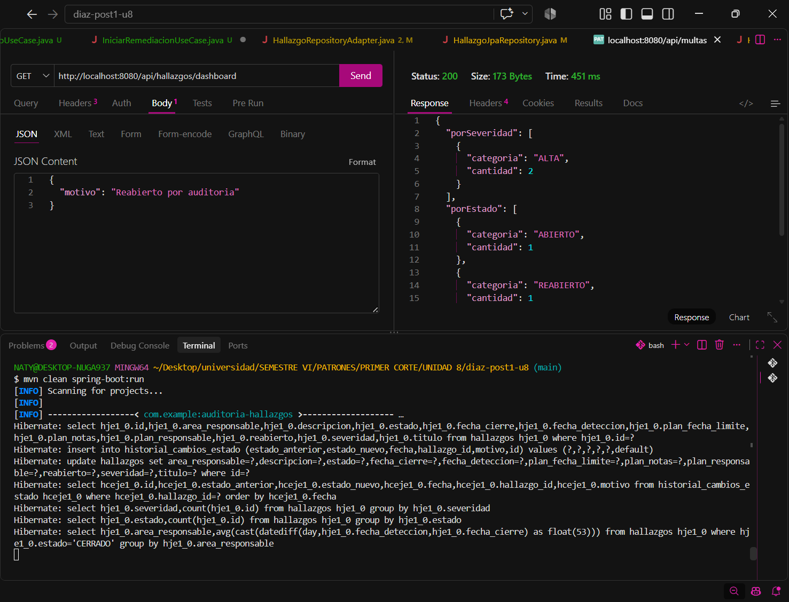

# Post-contenido — Unidad 8: Patrones Arquitectónicos II

## Descripción
Repositorio del post-contenido de la Unidad 8 de Patrones de Diseño de Software — Sexto Semestre. Sistema de seguimiento de hallazgos de auditoría interna implementado con Clean Architecture (Parte 1) y extendido, sobre el mismo proyecto Spring Boot, con un dashboard agregado y una bitácora de trazabilidad (Parte 2) tras un análisis costo-beneficio de CQRS/Event Sourcing.

---

## Parte 1 — Clean Architecture (Hallazgos de Auditoría)

El proyecto organiza los cuatro círculos concéntricos de Clean Architecture, garantizando que la dependencia del código siempre apunte hacia adentro, hacia `domain/`:

| Círculo | Paquete | Contenido |
| :--- | :--- | :--- |
| **Entities** | `domain/` | Aggregate Root `HallazgoAuditoria`; Value Objects `HallazgoId`, `Severidad`, `PlanRemediacion`; enum con máquina de estados `EstadoHallazgo`; `TransicionInvalidaException`. Sin imports de Spring ni JPA. |
| **Use Cases** | `usecase/` | Interfaces de casos de uso, puertos (`HallazgoRepositoryPort`, `HistorialAuditoriaPort`) e implementaciones en `impl/`. Sin imports de Spring. |
| **Interface Adapters** | `adapter/` | Entrada: `HallazgoController` y DTOs. Salida: entidades JPA, `HallazgoRepositoryAdapter` e `HistorialAuditoriaAdapter` (traducen dominio $\leftrightarrow$ JPA). |
| **Frameworks & Drivers** | `config/` | Spring Boot + JPA + H2. `AuditoriaConfiguration` hace el wiring explícito de casos de uso y puertos; los decoradores `*Transaccional` aplican `@Transactional` desde este círculo exterior para que `usecase/` no dependa de Spring. |

### Estructura del proyecto
```text
src/main/java/com/example/auditoria/
├── domain/
│   ├── entity/
│   │   └── HallazgoAuditoria.java
│   └── valueobject/
│       ├── EstadoHallazgo.java
│       ├── HallazgoId.java
│       ├── PlanRemediacion.java
│       ├── Severidad.java
│       └── TransicionInvalidaException.java
├── usecase/
│   ├── RegistrarHallazgoUseCase.java
│   ├── IniciarRemediacionUseCase.java
│   ├── CerrarHallazgoUseCase.java
│   ├── ReabrirHallazgoUseCase.java
│   ├── ConsultarHallazgoUseCase.java
│   ├── ObtenerDashboardAuditoriaUseCase.java
│   ├── port/
│   │   ├── HallazgoRepositoryPort.java
│   │   ├── HistorialAuditoriaPort.java
│   │   ├── ConteoCategoria.java
│   │   ├── PromedioCategoria.java
│   │   ├── DashboardAuditoriaView.java
│   │   └── CambioEstadoView.java
│   └── impl/
│       ├── RegistrarHallazgoService.java
│       ├── IniciarRemediacionService.java
│       ├── CerrarHallazgoService.java
│       ├── ReabrirHallazgoService.java
│       ├── ConsultarHallazgoService.java
│       └── ObtenerDashboardAuditoriaService.java
├── adapter/
│   ├── in/web/
│   │   ├── HallazgoController.java
│   │   └── dto/
│   │       ├── RegistrarHallazgoRequest.java
│   │       ├── IniciarRemediacionRequest.java
│   │       ├── ReabrirRequest.java
│   │       └── HallazgoResponse.java
│   └── out/persistence/
│       ├── HallazgoEntity.java
│       ├── HallazgoJpaRepository.java
│       ├── HallazgoRepositoryAdapter.java
│       ├── HistorialCambioEstadoEntity.java
│       ├── HistorialCambioEstadoJpaRepository.java
│       └── HistorialAuditoriaAdapter.java
├── ├── config/
│   ├── AuditoriaConfiguration.java
│   ├── IniciarRemediacionTransaccional.java
│   ├── CerrarHallazgoTransaccional.java
│   └── ReabrirHallazgoTransaccional.java
└── AuditoriaHallazgosApplication.java
```

---

## Parte 2 — Análisis costo-beneficio de CQRS / Event Sourcing

Nuevos requisitos del comité: (1) dashboard con conteos por severidad y estado y promedio de días de cierre por área; (2) trazabilidad cronológica e inmutable de cada cambio de estado. Análisis detallado según los criterios de las Secciones 4.4, 5.5 y 7 de la guía:

* **Escala y carga:** El sistema es un laboratorio académico con un solo desarrollador y 1 usuario concurrente. No hay asimetría entre lecturas y escrituras: ambas son de decenas de registros, así que no existe una carga que justifique infraestructura de lectura separada, réplicas ni servicios distintos. Separar los modelos añadiría despliegue y sincronización sin ningún problema de rendimiento que resolver.
* **Complejidad de las consultas:** Los tres indicadores del dashboard (conteo por severidad, conteo por estado y promedio de días entre detección y cierre por área) son agregaciones estándar. Se resuelven con consultas JPQL con `GROUP BY`, `COUNT` y `AVG` sobre el mismo esquema relacional, devueltas mediante interface projections de Spring Data JPA. Como `fechaCierre` ya se guarda desde la Parte 1, no hay cambios en el dominio ni se necesita otra base de datos u otro esquema.
* **Consistencia:** El comité consulta el dashboard antes de cada reunión mensual, como un reporte bajo demanda: no necesita actualización en tiempo real ni streaming. Al leer de la misma base transaccional, el reporte refleja siempre el último estado confirmado, sin retrasos de sincronización. No hay razón de negocio para aceptar consistencia eventual ni para introducir mensajería (Kafka/RabbitMQ) que alimente un modelo de lectura.
* **Naturaleza de la trazabilidad exigida:** Cumplimiento necesita reconstruir cronológicamente qué cambió y cuándo (estado anterior, estado nuevo, motivo y fecha), sin que el registro pueda alterarse. No necesita reconstruir el estado del hallazgo reproduciendo eventos. Basta una bitácora append-only (`HistorialCambioEstado`) que coexiste con el estado actual de `HallazgoEntity`, que sigue siendo la única fuente de verdad. *Nota: El laboratorio no cuenta con autenticación, por lo que la identificación del usuario en la bitácora queda planteada como una mejora futura mediante Spring Security.*
* **Señales de sobre-ingeniería (Sección 7.2):** No hay experto de negocio disponible para modelar eventos de dominio, el equipo (una persona) no tiene experiencia previa con Event Sourcing y no hay proyecciones futuras conocidas que justifiquen un Event Store. Mantener dos modelos, rehidratación por replay y manejo de eventos sería complejidad accidental desproporcionada frente a un problema que se resuelve con una consulta agregada y una tabla adicional.

**Conclusión:** No se justifica CQRS/Event Sourcing completos. Se implementó una extensión liviana: tres métodos de consulta agregada sobre el mismo `HallazgoRepositoryPort`/`HallazgoJpaRepository` y una bitácora append-only, manteniendo los cuatro círculos de Clean Architecture intactos.

---
## Decisiones de diseño

1. **Severidad como enum simple vs. EstadoHallazgo como enum con máquina de estados:**  
   `EstadoHallazgo` encapsula una regla de negocio real: qué transiciones son válidas (`ABIERTO` → `EN_REMEDIACION` → `CERRADO` → `REABIERTO` → `EN_REMEDIACION`), validadas por `puedeTransicionarA(...)`. `Severidad` (`CRITICA`, `ALTA`, `MEDIA`, `BAJA`) solo clasifica el riesgo: ninguna severidad es "más válida" que otra en un momento dado ni tiene reglas propias, así que darle comportamiento sería complejidad sin valor. Se habría preferido lo contrario si, por ejemplo, la severidad restringiera plazos de remediación o escalamientos.

2. **PlanRemediacion como Value Object embebido vs. agregado separado:**  
   Un hallazgo no puede pasar a `EN_REMEDIACION` sin un plan válido ni cerrarse sin uno definido, y esa invariante debe cumplirse siempre dentro de la misma transacción, sin ventanas de inconsistencia. Por el criterio de límite de consistencia transaccional de Bounded Contexts/Agregados (Sección 3.3 de la guía), el plan es un Value Object inmutable embebido en el agregado `HallazgoAuditoria`, no un agregado con repositorio propio.

3. **CQRS/Event Sourcing completos vs. extensión liviana del repositorio existente:**  
   Aplicando los criterios de la Sección 7 (escala, complejidad de consultas, consistencia y señales de sobre-ingeniería) y la Sección 4.4 (cuándo aplicar CQRS), las lecturas del dashboard son agregaciones simples sobre el mismo esquema y no hay carga asimétrica. Se extendió el puerto y el repositorio JPA existentes en lugar de crear un stack de lectura, evitando sincronizar múltiples modelos.

4. **Bitácora simple (`HistorialCambioEstado`) vs. Event Store completo:**  
   Un Event Store obligaría a que `HallazgoAuditoria` dejara de persistir su estado y se reconstruyera por replay, un cambio profundo sobre un agregado que ya funciona y sin necesidad real de reproducir estados intermedios (Sección 5.5). Las señales de sobre-ingeniería de la Sección 7.2 (sin experto en eventos, sin experiencia del equipo, costo desproporcionado) refuerzan la decisión. La bitácora es una tabla append-only que registra cada transición sin ser fuente de verdad del estado.La escritura de la bitácora ocurre en la misma transacción que el cambio de estado: se garantiza con decoradores `@Transactional` en `config/`, de modo que los casos de uso permanecen libres de dependencias de Spring.


## Cómo ejecutar

```bash
# Compilar y empaquetar (incluye pruebas)
mvn clean package

# Ejecutar solo las pruebas unitarias
mvn test

# Iniciar la aplicación (http://localhost:8080)
mvn spring-boot:run
```
Si no tienes Maven instalado, usa el wrapper incluido:

```bash
./mvnw clean package
./mvnw spring-boot:run   # En Windows: mvnw.cmd
```
## Endpoints

| Método | Ruta | Descripción |
| :---: | :--- | :--- |
| `POST` | `/api/hallazgos` | Registrar hallazgo |
| `PATCH` | `/api/hallazgos/{id}/iniciar-remediacion` | Iniciar remediación con plan |
| `PATCH` | `/api/hallazgos/{id}/cerrar` | Cerrar hallazgo |
| `PATCH` | `/api/hallazgos/{id}/reabrir` | Reabrir hallazgo (con motivo) |
| `GET` | `/api/hallazgos` | Listar hallazgos |
| `GET` | `/api/hallazgos/{id}` | Consultar hallazgo por ID |
| `GET` | `/api/hallazgos/dashboard` | Dashboard consolidado (Parte 2) |
| `GET` | `/api/hallazgos/{id}/historial` | Historial cronológico (Parte 2) |

## Checkpoints de validación (evidencias de pruebas)

| Checkpoint / Endpoint | Método HTTP | Estado esperado | Evidencia visual |
| :--- | :---: | :---: | :---: |
| **Registrar Hallazgo** | `POST` | `201 Created` |  |
| **Iniciar Remediación** | `PATCH` | `200 OK` |  |
| **Cerrar Hallazgo** | `PATCH` | `200 OK` |  |
| **Reabrir Hallazgo** | `PATCH` | `200 OK` |  |
| **Error al Cerrar Sin Plan** | `PATCH` | `400 Bad Request` |  |
| **Pruebas Unitarias JUnit** | `mvn test` | `BUILD SUCCESS` |  |
| **Historial Cronológico (Parte 2)** | `GET` | `200 OK` |  |
| **Dashboard de Métricas (Parte 2)** | `GET` | `200 OK` |  |

## Herramientas Utilizadas
Java 17 & Spring Boot 3.x

Spring Data JPA & H2 Database

Apache Maven

Thunder Client / Postman

Git & GitHub

## Conclusiones
Clean Architecture permitió aislar las reglas de negocio (máquina de estados e invariantes del agregado) de la persistencia y del framework web, y el mismo diseño absorbió los nuevos requisitos sin tocar el dominio. El análisis costo-beneficio mostró que CQRS y Event Sourcing son una respuesta a un contexto (escala, asimetría de carga, necesidad de replay), no a un tipo de requisito: aquí bastaron consultas agregadas y una bitácora append-only. Si el sistema creciera a millones de hallazgos con alta concurrencia de lecturas analíticas, si el dashboard exigiera latencia baja con modelos de lectura propios, o si Cumplimiento requiriera auditoría forense con reconstrucción del estado por replay, se reconsideraría separar los modelos de lectura y escritura con un Event Store.