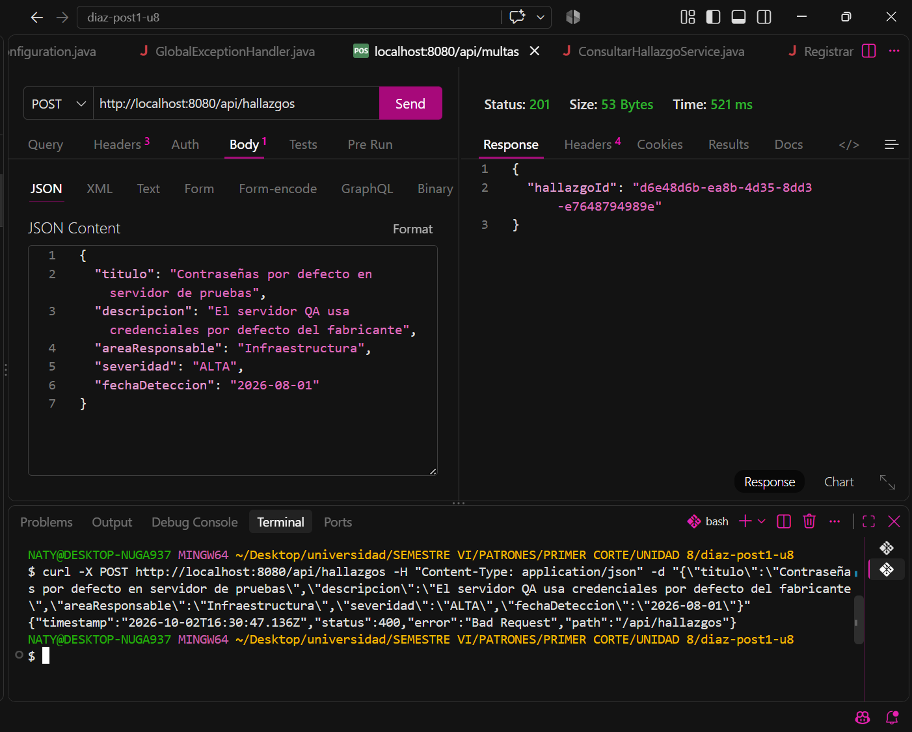
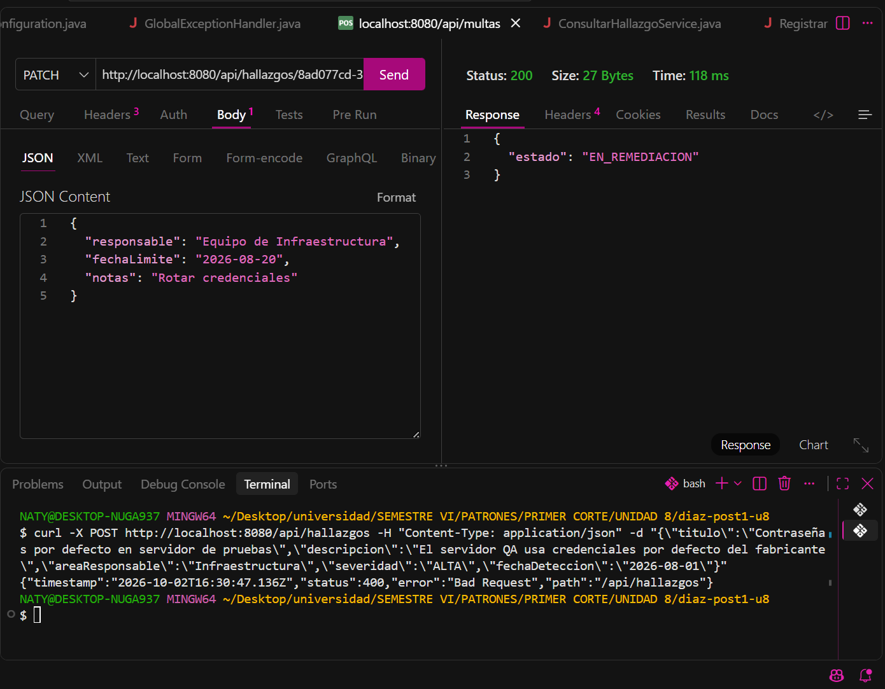
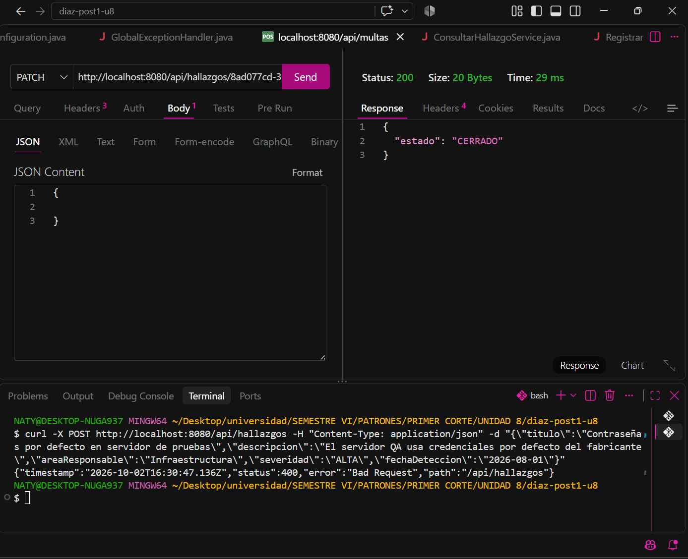
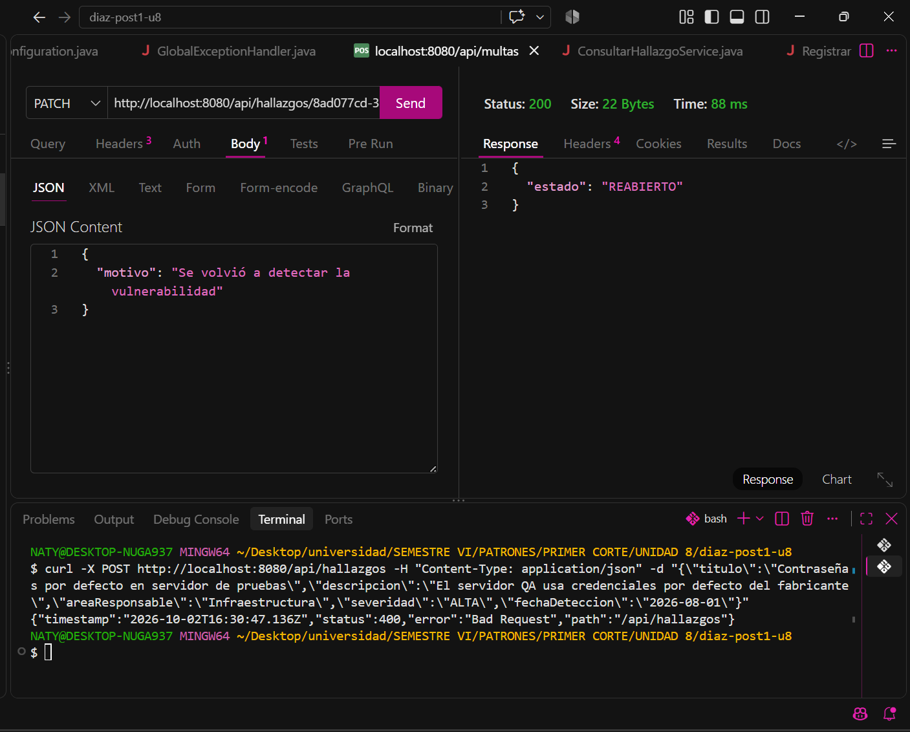
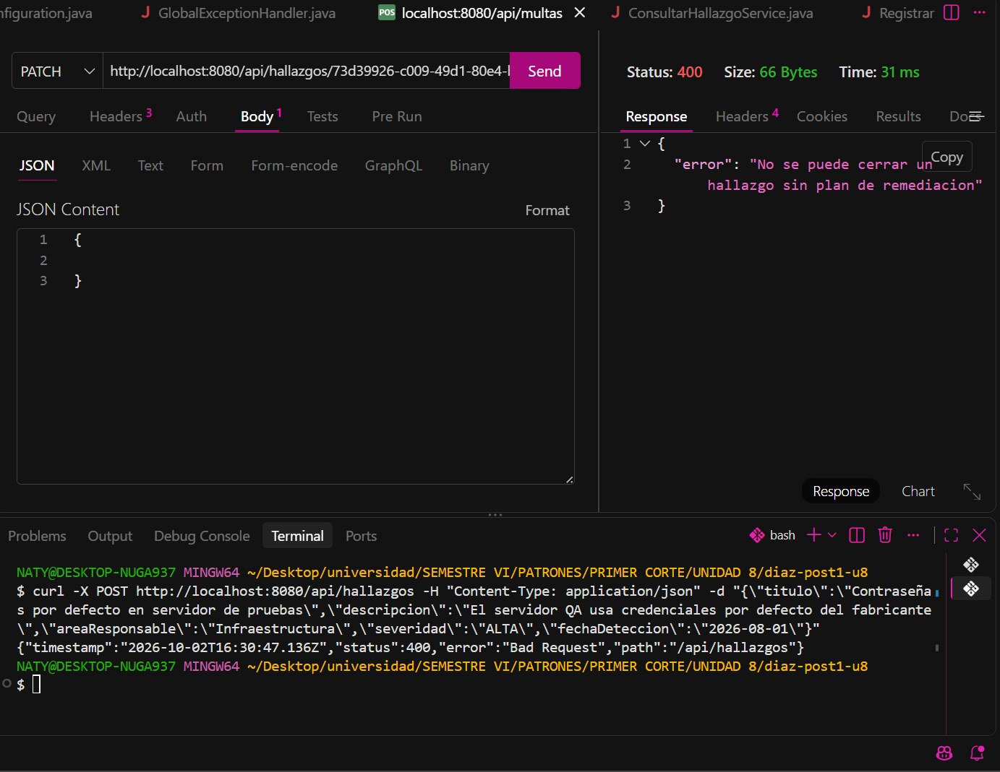
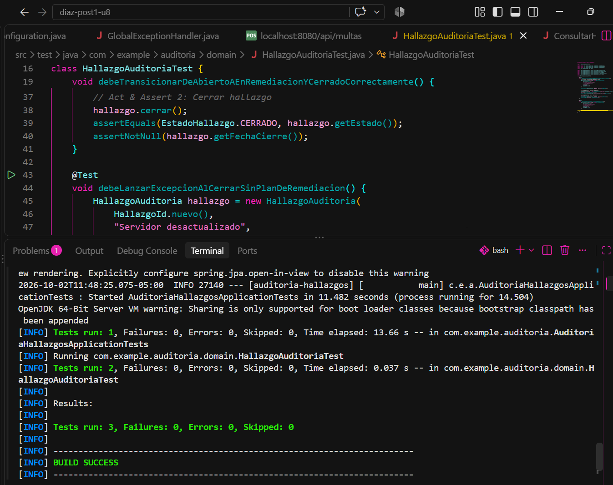
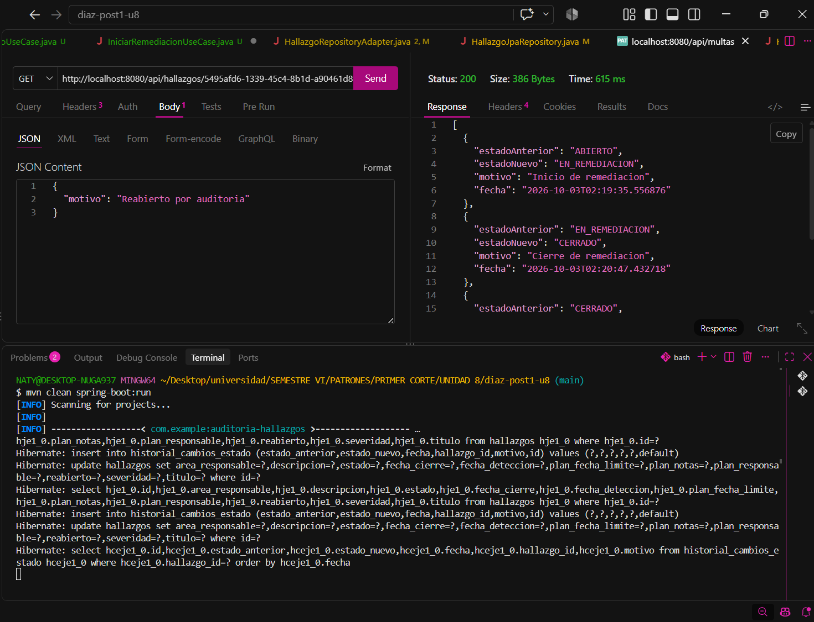
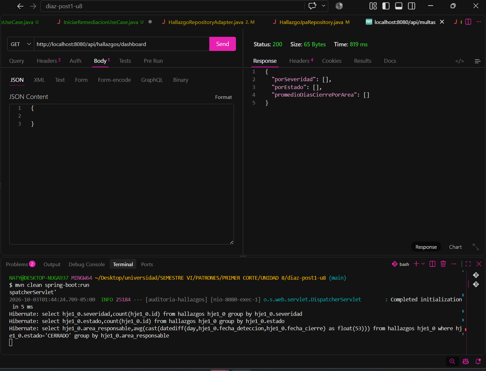

# Post-contenido — Unidad 8: Patrones Arquitectónicos II

## Descripción
Repositorio del post-contenido de la Unidad 8 de Patrones de Diseño de Software — Sexto Semestre. Sistema de seguimiento de hallazgos de auditoría interna implementado con Clean Architecture (Parte 1) y extendido con dashboard agregado y bitácora de trazabilidad (Parte 2), sobre el mismo proyecto Spring Boot.

---

## Parte 1 — Clean Architecture (Hallazgos de Auditoría)
El proyecto organiza los cuatro círculos concéntricos: **Entities** (`domain/`, con el Aggregate Root `HallazgoAuditoria` y su máquina de estados `EstadoHallazgo`), **Use Cases** (`usecase/`, con los puertos y sus implementaciones), **Interface Adapters** (`adapter/`, con `HallazgoController` y `HallazgoRepositoryAdapter`) y **Frameworks & Drivers** (Spring Boot + JPA). La dependencia del código siempre apunta hacia adentro, hacia `domain/`.

### Estructura del Proyecto
```text
src/main/java/com/example/auditoria/
├── domain/
│   ├── entity/
│   │   └── HallazgoAuditoria.java
│   └── valueobject/
│       ├── EstadoHallazgo.java
│       ├── HallazgoId.java
│       ├── PlanRemediacion.java
│       ├── Severidad.java
│       └── TransicionInvalidaException.java
├── usecase/
│   ├── port/
│   │   ├── HallazgoRepositoryPort.java
│   │   ├── HistorialAuditoriaPort.java
│   │   └── ...
│   ├── impl/
│   │   ├── RegistrarHallazgoService.java
│   │   ├── IniciarRemediacionService.java
│   │   ├── CerrarHallazgoService.java
│   │   ├── ReabrirHallazgoService.java
│   │   └── ObtenerDashboardAuditoriaService.java
├── adapter/
│   ├── in/web/
│   │   ├── HallazgoController.java
│   │   └── ...
│   └── out/persistence/
│       ├── HallazgoEntity.java
│       ├── HistorialCambioEstadoEntity.java
│       ├── HallazgoJpaRepository.java
│       └── HistorialAuditoriaAdapter.java
└── config/
    └── AuditoriaConfiguration.java
```
## Parte 2 — Análisis Costo-Beneficio de CQRS / Event Sourcing

* **Escala y carga:** El sistema cuenta con **1 usuario concurrente** en un entorno académico y de baja demanda. La carga de trabajo es modesta, por lo que no existe una asimetría o volumen crítico entre operaciones de lectura y escritura que justifique separar bases de datos física o lógicamente en microservicios distintos.
* **Complejidad de las consultas:** Las métricas solicitadas para el dashboard (conteos agrupados por severidad/estado y promedios de días de cierre por área) se resuelven de manera óptima mediante consultas JPQL con agregaciones estándar (`GROUP BY`, `COUNT`, `AVG`) directamente sobre la base de datos relacional. No se requiere una BD no relacional de lectura ni proyecciones asíncronas complejas.
* **Consistencia:** El reporte del dashboard requiere **consistencia inmediata** (*Strong Consistency*) al momento de la consulta. No existe una necesidad de negocio para manejar *Eventual Consistency* ni para incorporar intermediarios de mensajería (como Kafka o RabbitMQ) para sincronizar modelos de lectura.
* **Naturaleza de la trazabilidad exigida:** El área de Cumplimiento requiere únicamente auditar los cambios de estado (quién, cuándo y motivo). Una bitácora de auditoría inmutable (*append-only*) que registre cada transición y coexista con el estado actual del hallazgo cumple cabalmente la exigencia, sin necesidad de reconstruir el estado mediante reproducción de eventos (*event replay*).
* **Señales de sobre-ingeniería:** Mantener modelos de datos separados, infraestructura de mensajería, controladores de eventos y mecanismos de rehidratación para un equipo de un solo desarrollador implicaría una enorme complejidad accidental. El costo de implementación y mantenimiento superaría drásticamente cualquier beneficio operativo.

**Conclusión:** No se justifica la adopción de CQRS/Event Sourcing completos. La extensión liviana implementada sobre el mismo repositorio y modelo relacional satisface al 100% las necesidades funcionales y no funcionales del sistema manteniendo la arquitectura simple y limpia.

## Decisiones de diseño

1. **Severidad como enum simple vs. EstadoHallazgo como enum con máquina de estados:**  
   `Severidad` (`BAJA`, `MEDIA`, `ALTA`, `CRITICA`) es un Value Object estático que clasifica el nivel de riesgo. `EstadoHallazgo` (`ABIERTO`, `EN_REMEDIACION`, `CERRADO`, `REABIERTO`) modela una máquina de estados explícita que encapsula y valida las reglas y transiciones permitidas del ciclo de vida del hallazgo dentro del dominio.

2. **PlanRemediacion como Value Object embebido vs. agregado separado:**  
   Se diseñó como un Value Object inmutable embebido en `HallazgoAuditoria` para respetar el límite de consistencia transaccional: un hallazgo no puede pasar a remediación o cierre sin un plan válido asociado de forma atómica dentro del mismo agregado.

3. **CQRS/Event Sourcing completos vs. extensión liviana del repositorio existente:**  
   Se optó por la extensión liviana extendiendo las capacidades de consulta con métodos de agregación JPQL en el repositorio existente. Esto evita la complejidad accidental de sincronizar múltiples esquemas de datos cuando el volumen de lecturas y escrituras es manejable en la misma base de datos.

4. **Bitácora simple (`HistorialCambioEstado`) vs. Event Store completo:**  
   Se implementó una entidad de bitácora *append-only* dedicada a registrar cada transición de estado. Esto garantiza la inmutabilidad y la auditabilidad requeridas por Cumplimiento sin incurrir en la sobre-ingeniería de almacenar todos los eventos de dominio y reconstruir agregados a partir de ellos.

## Checkpoints de Validación (Evidencias de Pruebas)

| Checkpoint / Endpoint | Método HTTP | Estado Esperado | Evidencia Visual |
| :--- | :---: | :---: | :---: |
| **Registrar Hallazgo** | `POST` | `201 Created` |  |
| **Iniciar Remediación** | `POST` | `200 OK` |  |
| **Cerrar Hallazgo** | `POST` | `200 OK` |  |
| **Reabrir Hallazgo** | `POST` | `200 OK` |  |
| **Error al Cerrar Sin Plan** | `POST` | `400 Bad Request` |  |
| **Pruebas Unitarias JUnit** | `mvn test` | `BUILD SUCCESS` |  |
| **Historial Cronológico (Parte 2)** | `GET` | `200 OK` |  |
| **Dashboard de Métricas (Parte 2)** | `GET` | `200 OK` |  |

## Cómo Ejecutar

```bash
# Compilar el proyecto
mvn clean compile

# Ejecutar las pruebas unitarias
mvn test


# Iniciar la aplicación Spring Boot
mvn spring-boot:run
```
## Herramientas Utilizadas
Java 17 & Spring Boot 3.x

Spring Data JPA & H2 Database

Apache Maven

Thunder Client / Postman

Git & GitHub

## Conclusiones
La implementación de Clean Architecture en este proyecto demostró el valor de aislar las reglas de negocio en el dominio central, desacoplándolas por completo de tecnologías de persistencia o frameworks web. Al abordar los nuevos requerimientos del dashboard y la trazabilidad, se evidenció que la toma de decisiones arquitectónicas debe responder al análisis riguroso del contexto y la escala del sistema, evitando patrones complejos como CQRS o Event Sourcing cuando una extensión liviana resuelve las necesidades con menor complejidad. En el futuro, si la aplicación creciera hacia millones de hallazgos con alta concurrencia de lecturas analíticas frente a escrituras o requiriera auditoría forense con event replay, se reconsideraría la separación formal de modelos de lectura y escritura mediante un Event Store distribuido.